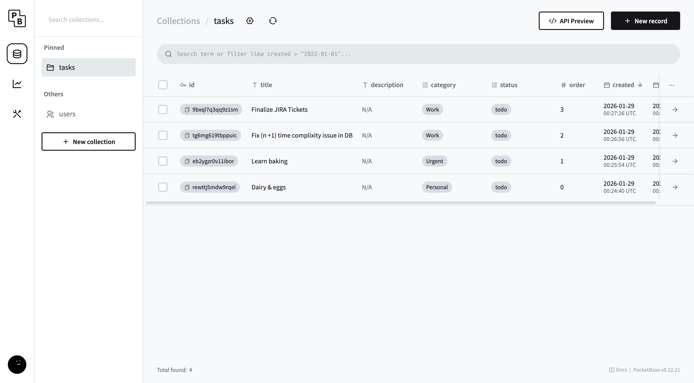
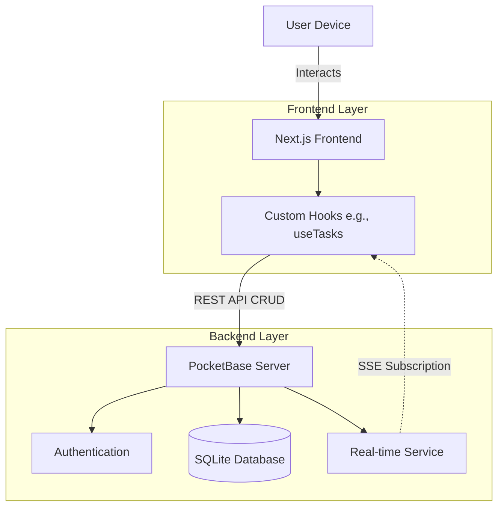

# Velocity Task Manager

A real-time, high-performance task manager built with Next.js, PocketBase, and Framer Motion.

## Features

- ⚡ **Real-time Updates**: Changes reflect instantly across all connected clients.
- 🎨 **Premium UI**: Glassmorphism design with Dark/Light mode.
- 🎭 **Animations**: Smooth enter, exit, and reorder animations using Framer Motion.
- 📱 **Responsive**: Works perfectly on all devices.

## Tech Stack

- **Frontend**: Next.js 16+, Tailwind CSS, Framer Motion, Shadcn UI
- **Backend**: PocketBase
- **Deployment**: [Vercel](https://vercel.com) (Frontend), [PikaPods](https://pikapods.com) (PocketBase Backend)

## PocketBase Deployment (PikaPods)

Since PocketBase requires persistent SQLite storage, it is deployed on PikaPods.

### How to Sync the Schema

If you need to deploy to a new PocketBase instance or reset your schema, you can use the automated sync script:

1. **Obtain Credentials**: Get your Admin Email and Password from your PikaPods dashboard.
2. **Configure Script**: Open [scripts/sync-schema.ts](scripts/sync-schema.ts) and update the `PB_URL`, `ADMIN_EMAIL`, and `ADMIN_PASSWORD`.
3. **Run Sync**:
   ```bash
   bun run scripts/sync-schema.ts
   ```

This script will automatically:

- Authenticate with your PocketBase instance.
- Create or update the `tasks` collection.
- Ensure all required fields (`title`, `description`, `category`, `status`, `order`, `created`, `updated`) are correctly configured.
- Set up API rules for public access (testing mode).

### Environment Variables

Ensure your Vercel (or local `.env.local`) is pointing to the correct backend:

```env
NEXT_PUBLIC_POCKETBASE_URL=https://competent-deer.pikapod.net
```

## Database Snapshot

The screenshot below shows the PocketBase Admin UI with the `tasks` collection containing sample data:



**Sample Data in the `tasks` Collection:**

| ID              | Title                                 | Description | Category | Status | Order | Created    | Updated    |
| --------------- | ------------------------------------- | ----------- | -------- | ------ | ----- | ---------- | ---------- |
| 6haj7q3sptrz1sm | Finalize JIRA Tickets                 | N/A         | Work     | todo   | 3     | 2026-01-29 | 2026-01-29 |
| 1p0ng1jt9pquk   | Fix (n+1) time complexity issue in DB | N/A         | Work     | todo   | 2     | 2026-01-29 | 2026-01-29 |
| eb2ygn0v110sr   | Learn baking                          | N/A         | Urgent   | todo   | 1     | 2026-01-29 | 2026-01-29 |
| rnwtj0ndwmppl   | Dairy & eggs                          | N/A         | Personal | todo   | 0     | 2026-01-29 | 2026-01-29 |

**`tasks` Collection Schema:**

| Field         | Type              | Description                                            |
| ------------- | ----------------- | ------------------------------------------------------ |
| `id`          | string            | Unique identifier (auto-generated by PocketBase)       |
| `title`       | string            | The task title/name                                    |
| `description` | string (optional) | Detailed description of the task                       |
| `category`    | string            | Task category: `Work`, `Personal`, `Urgent`, or custom |
| `status`      | string            | Task status: `todo`, `in_progress`, or `done`          |
| `order`       | number            | Position for drag-and-drop reordering                  |
| `created`     | datetime          | Timestamp when the task was created                    |
| `updated`     | datetime          | Timestamp when the task was last updated               |

## System Architecture

The following diagram illustrates how the Velocity components interact to provide a real-time experience:



The system leverages PocketBase's real-time subscription capabilities to ensure that any change (create, update, delete) made by one client is instantly propagated to all other connected clients via Server-Sent Events (SSE).

## Setup Instructions

### 1. Prerequisites

- Node.js 18+
- PocketBase executable (or hosted instance)

### 2. Backend Setup (PocketBase)

1. Download PocketBase from [pocketbase.io](https://pocketbase.io/docs/) (or use the script provided in `scripts/`).
2. Run it locally: `./pocketbase serve`.
3. **Automated Schema Setup**: The project includes a migration file in `pb_migrations/`. PocketBase will automatically apply this migration when you start the server, creating the `tasks` collection with the correct schema and public API rules.
   - You can verify this by opening the Admin UI at `http://127.0.0.1:8090/_/`.
   - The `tasks` collection will be present with fields: `title`, `description`, `category`, `status`, `order`.

### 3. Frontend Setup

1. Clone repository.
2. Install dependencies:
   ```bash
   npm install
   ```
3. Create `.env.local` (optional if using default local PB):
   ```env
   NEXT_PUBLIC_POCKETBASE_URL=http://127.0.0.1:8090
   ```
4. Run dev server:
   ```bash
   npm run dev
   ```

## Deployment

### Deploy Backend to Render(optional)

1. Create a Web Service on Render properly Dockerized or using the PocketBase binary.
2. Update `NEXT_PUBLIC_POCKETBASE_URL` in Vercel.

### Deploy Frontend to Vercel

1. Push to GitHub.
2. Import project to Vercel.
3. Add environment variable `NEXT_PUBLIC_POCKETBASE_URL` pointing to your hosted PocketBase.

## License

MIT
